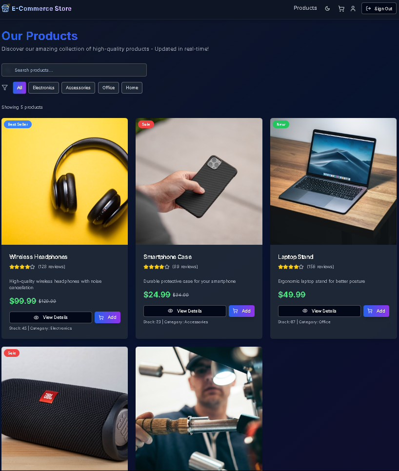
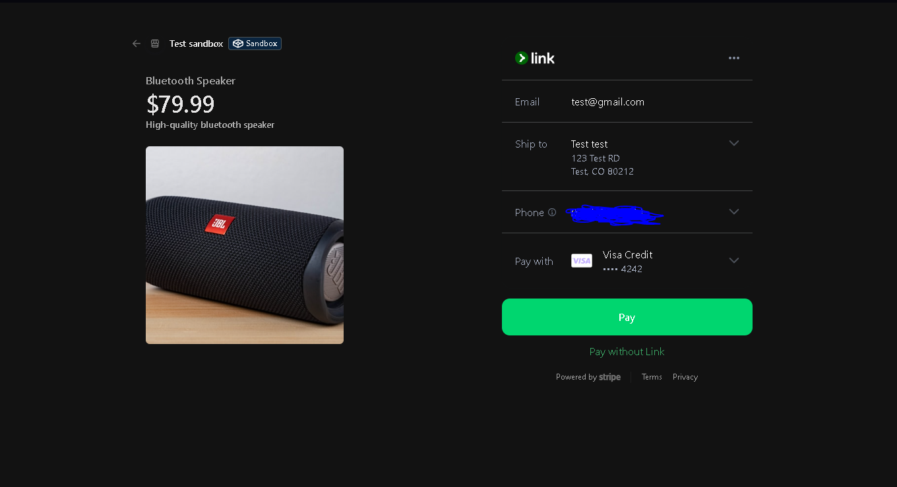
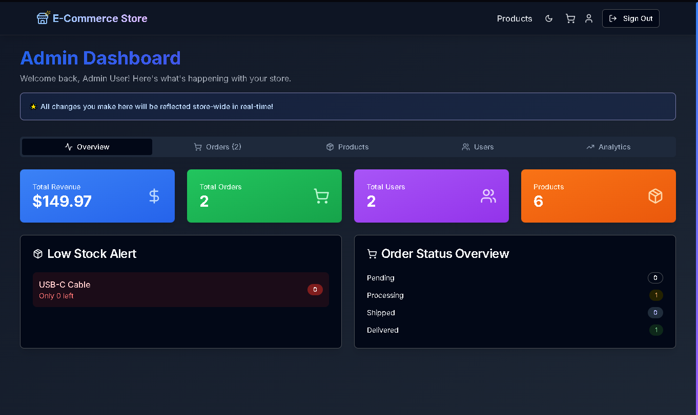

# Full-Stack E-Commerce Platform

A full-featured e-commerce web application supporting secure payments, inventory management, and admin order tracking.

## Screenshots

### Product Browsing & Details



### Cart & Checkout



### Admin Dashboard


## 🚀 Live Demo
https://ecommerce-store-mu-five.vercel.app

## 📌 About
This project simulates a real-world online store where users can browse products, manage a cart, and complete purchases using Stripe. The focus was on secure payment handling, backend data integrity, and scalable API design.

## ⚙️ Key Features
- Secure Stripe checkout with webhook verification
- User authentication using JWT
- Admin dashboard for order and product management
- Responsive design for mobile and desktop

## 🛠 Tech Stack
**Frontend:** React, Tailwind CSS  
**Backend:** Node.js, Express.js  
**Database:** PostgreSQL  
**Other:** Stripe API, JWT, REST APIs

## 🧠 Challenges Solved
- Implemented Stripe webhooks to prevent duplicate charges
- Designed relational schemas optimized for fast queries
- Secured admin-only routes with authentication middleware

## 🚀 Getting Started
```bash
git clone https://github.com/Turbo9k/Ecommerce.git
cd Ecommerce
npm install
npm run dev
